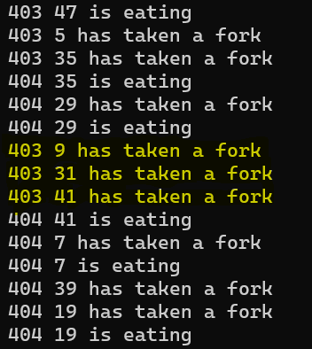

# The Dining Philosophers Problem

The code is in C and uses threads and mutexes to solve the problem.  

The problem involves issues of execution sequence and access to variables. Such as *resource starvation*, *mutual exclusion*, *livelock* e *deadlock*.

  

## Key concepts

### **Thread** 

A program can have several processes and each **process** can have a certain number of **threads** running in it.

A **thread** is a basic unit of execution within a **process**.

**Threads** are like little workers inside a program. They help to do several tasks at the same time, as if they were several hands working together. This can make the program faster and more efficient.

Each **thread** has a unique **id** within a **process** and also has its own stack. There is also a Register Set which contains all the registers needed to run the thread, including the Program Counter, which is responsible for storing the address of the next instruction to be executed in the **thread**.

**Threads** do not execute anything other than the function passed as a parameter in pthread_create.

### **Mutex** 

**Mutex** (mutual exclusion) is a synchronization tool that ensures that only one thread or process can access a shared resource at a time, preventing data races and guaranteeing data consistency.

In this project, the forks needed for the philosopher to eat are mutexes. And they are used to ensure that a fork is not being used by another philosopher. When a philosopher tries to take a fork, it tries to acquire (lock) the mutex associated with that fork. If the mutex is already locked by another thread, the current thread will have to wait until the mutex is released. This is a fundamental feature of mutexes and is what guarantees mutual exclusion, i.e. that only one thread can access a critical resource (in this case, a fork) at a time.
In the context of my code, when a thread (representing a philosopher) tries to take a fork, it calls pthread_mutex_lock for the mutex associated with that fork. If the mutex is already blocked by another philosopher, the current thread will be blocked until the mutex is freed.

### **Data races**

Condition: Two or more threads simultaneously accessing a memory location AND one of them is a write AND there are no synchronization mechanisms.

### **Deadlocks**

The number of forks is equal to the number of philosophers and each philosopher needs 2 forks to eat. So, if all the philosophers try to pick up the forks at the same time, there could be a deadlock situation. A **deadlock** occurs when each philosopher holds one fork and waits for the other, resulting in a situation where no philosopher can continue. To contain this, a usleep() is inserted into the execution of threads with odd ids.

The mutexes must be locked in order according to their indexes!

In a **Livelock**, the threads or processes continue to change state and try to solve the problem, but make no useful progress.

### **Resource Starvation**

**Resource Starvation** (or simply starvation) is a condition in computer systems where a thread or process is continually prevented from accessing the resources it needs to make progress, due to the prioritization of other threads or processes. This can occur in CPU scheduling systems, memory management, or any system where multiple entities compete for limited resources.

## Testing
To test the operation of threads and mutexes:
1) fsanitize=thread in compilation.
2) Do not use flags in the compilation and run valgrind with -tool=helgrind.

***For the sanitization options to work properly, they need to be applied in both the compilation and linking phases.***

# About this project

In this code a philosopher picks up a fork that was previously in use only after the philosopher who was using it has gone to sleep. This makes it explicit in the state logs that no forks are being stolen.

In this code, I've also avoided a very recurrent situation in the projects of many of my colleagues. Including one that I've been evaluating over the last few days. It goes like this. After printing the “died” state of a particular philosopher, the program subsequently prints more states for other philosophers. This is not supposed to be the case, as the game ends when a philosopher dies. By dealing with this problem, I ended up making my program better and more performant than it was before this improvement. 

I believe it is plausible to require that there is no time inconsistency for the tests explicitly defined in the project's evaluation sheet. See this screenshot as an example of inconsistency.  
  

In my program's start synchronization function, the usleep value used to avoid busy-waiting should be chosen based on the machine's processing capacity.

One question I had was whether it was necessary for everyone to start the simulation thinking. Because the subject says that the philos are always eating, sleeping or thinking. So what is the state at the time the simulation starts? My colleagues' projects don't print the “is thinking” state before the first meal. So I decided to keep my implementation within the school's culture. And before the first meal, the state is not determined through the state prints.

I've added -lptrhead to the compile line (it's a linking flag). Explicitly specifying the -lpthread flag in your Makefile is a good practice to ensure that your program compiles and links correctly in different environments and systems. 

As a curiosity, have you noticed any paradoxes in this exercise? Yes, a philosopher can starve while eating. This happens if the time_to_die is less than the time_to_eat.

*** 

*Our colleague Luís Miguel (intra: lleiria-) made a very nice animation to explain some of the logic of the problem. You can check it out here: https://www.youtube.com/watch?v=HbBYHRBJ47Q*
